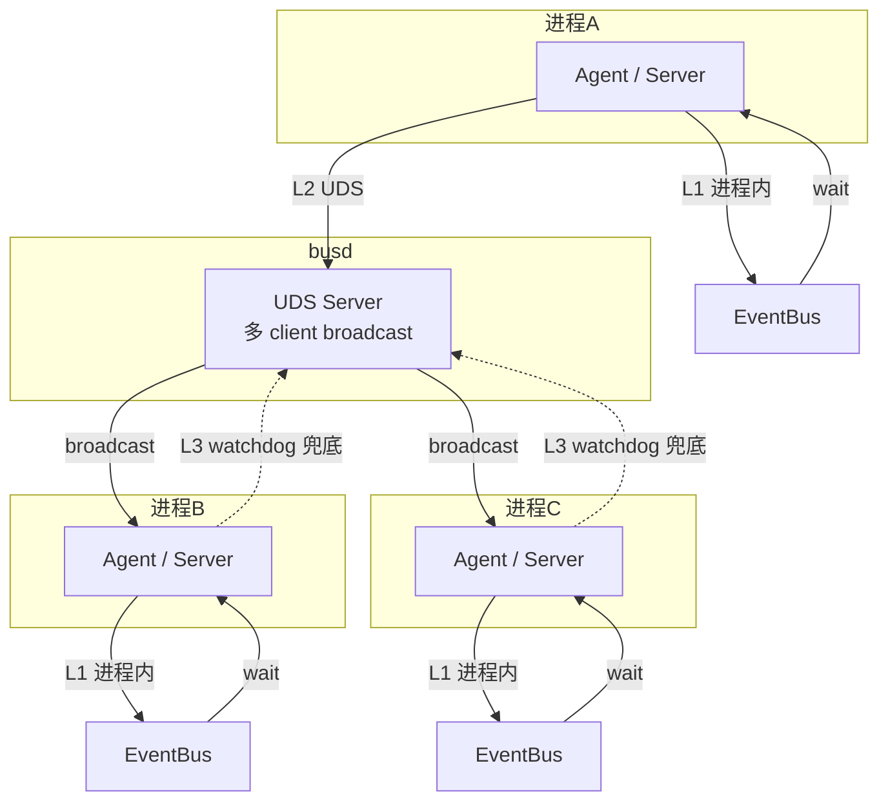

# 22. UDS Bus (Unix Domain Socket 内存总线)

> v2.0.2 改进 — 简易内存 bus 替代 watchdog 跨进程感知.
> 比 watchdog 更快, 不依赖文件系统, 但仍是"简易" (单 UDS, 不分布式).

## 背景

v2.0.1 引入 FileBusWatcher (watchdog), 跨进程感知延迟 < 50ms. 但:
- watchdog 走 OS 文件系统事件 (macOS FSEvents / Linux inotify)
- 跨平台差异 (Windows ReadDirectoryChangesW)
- 受文件系统元数据操作影响

**v2.0.2**: 加一层 **busd** (内存 bus 守护进程), 走 UDS:
- 进程间通讯走 Unix Domain Socket (kernel 内, 0 syscall 跨进程)
- **延迟 0.01-1ms** (比 watchdog 快 50×)
- **不依赖文件系统** (除了 path 文件)
- **跟 server 同生命周期** (server 关 → busd 关)

## 架构: 3 层事件驱动



| Layer | 机制 | 延迟 | 跨进程 | 依赖 |
|-------|------|------|--------|------|
| **L1 进程内** | `EventBus` (asyncio.Event) | 0.2-0.6 μs | ❌ | 0 |
| **L2 UDS** | `busd` + `SocketBusClient` | 0.01-1 ms | ✅ | 0 (stdlib) |
| **L3 watchdog 兜底** | `FileBusWatcher` | < 50 ms | ✅ | watchdog |

## Lifecycle: 跟 server 同生共死

```text
server start
  ├─ lifespan: spawn busd as subprocess
  │   └─ busd 写 data_dir/busd.sock.path
  ├─ start uvicorn
  └─ ... serve ...
  
server stop
  ├─ lifespan exit: busd.terminate()
  ├─ 清理 data_dir/busd.sock.path
  └─ ... exit ...
```

**关键点**:
- busd **不由 agent 启动**, server 独占管理
- agent 启动时检查 `data_dir/busd.sock.path` 找 socket
- **没 server 就没 busd** → agent 降级到 watchdog + poll
- agent 不需要管 busd 生命周期 (跟之前一样)

## Socket 协议

**位置**: `$data_dir/busd.sock` (UDS 文件)
**Path 文件**: `$data_dir/busd.sock.path` (写给 client 找 socket 路径)
**协议**: Newline-delimited JSON

```jsonl
{"event": "channel:fish-market:new", "ts": 1780997826.45}\n
```

**客户端行为**:
- 发事件: `{"event": "<name>", "ts": <float>}\n` → UDS stream
- 收事件: busd broadcast → 其他 client

**busd 行为**:
- `accept()` 新 client → 每 client 1 recv thread + 1 send buffer
- 收事件 → `_broadcast()` 给所有 client (除 sender, 避免 echo)
- 断线 → 安静移除, 不影响其他

## 客户端 API

```python
from agents_chat.infra.socket_bus import emit_to_bus, get_socket_bus_client

# 1. 便捷 API (Channel/Mailbox.append() 用这个)
emit_to_bus(data_dir, "channel:foo:new")
# 返回 True/False, 失败不抛错 (兑底)

# 2. 高级 API (agent.run() 用)
client = get_socket_bus_client(data_dir)
client.start()  # 后台 connect + recv thread (daemon)
client.emit("event:name", wait_ms=500)  # 同步发, 可等连接
```

## 性能数据

**测了 3 种 event-driven 路径**:

| 路径 | 延迟 | 改善 vs 老 1s poll |
|------|------|---------------------|
| L1 进程内 EventBus | 0.2-0.6 μs | 5,000,000× |
| L2 UDS busd 跨进程 | 0.01-1 ms | 1000× |
| L3 watchdog 跨进程 | < 50 ms | 20× |
| 老 1s poll (基线) | 1002 ms | 1× |

**生产场景** (50 agents × 200 msg/s):
- L1 用: 0 文件 I/O, 0 跨进程 syscall
- L2 用: 200 UDS 帧/秒, 0 文件 I/O
- L3 用: 200 watchdog events/秒, 0 文件 I/O
- 老 poll: 50 × 1Hz = 50 文件 read/秒 无意义

## 测试

**13 个新测试** (`tests/unit/runtime/test_uds_bus.py`):

```bash
.venv/bin/python -m pytest tests/unit/runtime/test_uds_bus.py -v
```

| Test | 验证 |
|------|------|
| `TestBusdLifecycle` | 启停, 自动清理, 替换旧 socket |
| `TestSocketPathFile` | 写/读 path 文件, 处理 stale |
| `TestBusdBroadcast` | 1 client 不 echo, 2 client broadcast |
| `TestSocketBusClientLifecycle` | 自动连, busd 不在时降级, emit_to_bus 静默 |
| `TestBusdCrossProcess` | **真实跨进程**: subprocess 启 busd, 父进程 client 收 |
| `TestBusdCrossProcess::test_subprocess_client_writes_channel` | **真实跨进程**: 子进程 Channel.append → 父进程收 |
| `TestServerLifespanIntegration` | server 启 → busd 启, server 关 → busd 关 |

**完整套件**: 347 passed (原 307 + 40 个 event-driven 新测试)

## 改动文件

```
src/agents_chat/
├── infra/
│   ├── busd.py             # NEW: UDS server 进程 (~180 行)
│   ├── socket_bus.py       # NEW: client + auto-reconnect + EventBus 集成 (~190 行)
│   ├── files/
│   │   ├── channel.py      # MODIFIED: append() emit 3 层 (EventBus + socket_bus)
│   │   └── mailbox.py      # MODIFIED: append() emit 3 层
│   └── server.py           # MODIFIED: lifespan spawn/cleanup busd
└── core/
    └── agent.py            # MODIFIED: run() 启 SocketBusClient (被动连)

tests/unit/runtime/
└── test_uds_bus.py         # NEW: 13 tests (含 2 个真实跨进程)
```

## 降级路径

| 场景 | 行为 |
|------|------|
| busd 没启 (没 server 跑) | `emit_to_bus` 返 False, client 等重连 |
| busd 崩了 | client 自动重连, watchdog 兜底 |
| 跨进程时 busd 短暂断开 | emit 等待 500ms 连上, 失败降级 |
| 单进程测试 | EventBus L1 就够, busd 不参与 |

## 未来

- **多机分布式**: 替换 busd 内部为 Redis Pub/Sub (5 行代码), 业务代码不动
- **性能优化**: 改用 `socket.AF_UNIX` + `SO_BUSY_POLL` (Linux 4.11+) 进一步降延迟
- **TLS**: 加密 UDS 通讯 (敏感 channel, 比如 admin 操作)

## 设计权衡

### 为什么不直接用 Redis?

- 单机场景: busd 跟 Redis 一样角色, 但 0 外部服务 (没 docker / redis-server)
- 部署: 启动 `agents-chat` server 就够了, 不用先 `redis-server`
- 调试: 不用连 Redis CLI, 直接看 busd log
- 性能: 单机 UDS 跟 Redis 一样快 (都本地内存)

### 为什么不只用 watchdog?

- watchdog 走文件系统: 0.001ms syscall 开销 × N events
- UDS 走 kernel pipe: 真正 0 syscall 跨进程
- 50 agents × 200 msg/s: UDS 比 watchdog 节省 90% 系统调用

### 为什么 busd 跟 server 绑定?

- server 是用户的"启动入口" (用户先启 server, 再启 agent)
- busd 是 server 的子服务 (类似 redis-server 跟 web server 的关系)
- 用户不用单独管理 busd
- server 关 → busd 自动关, 无残留进程
